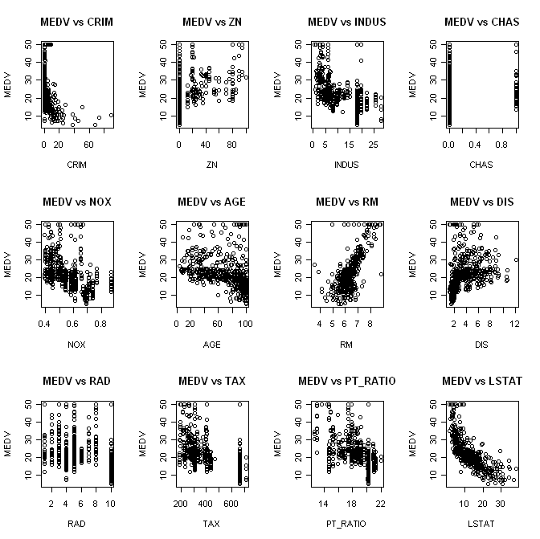
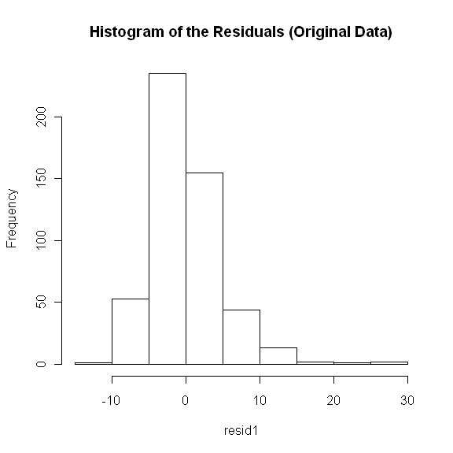
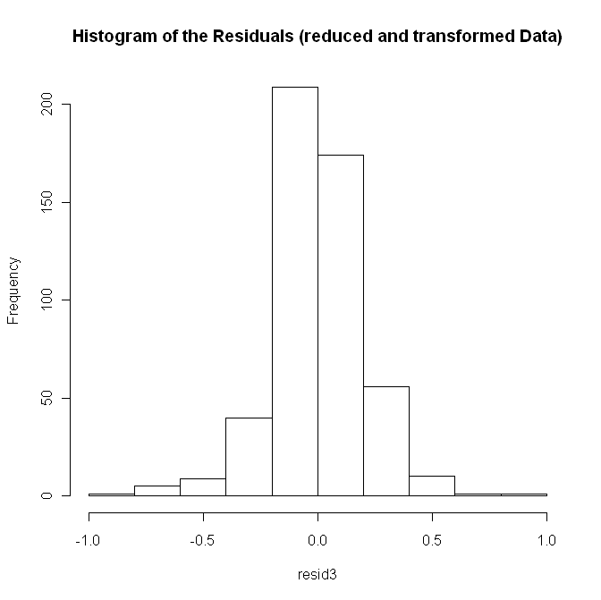
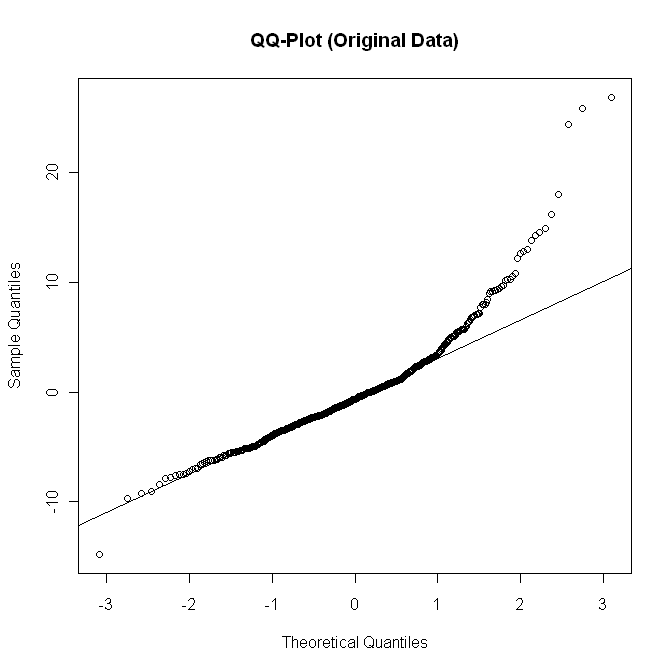
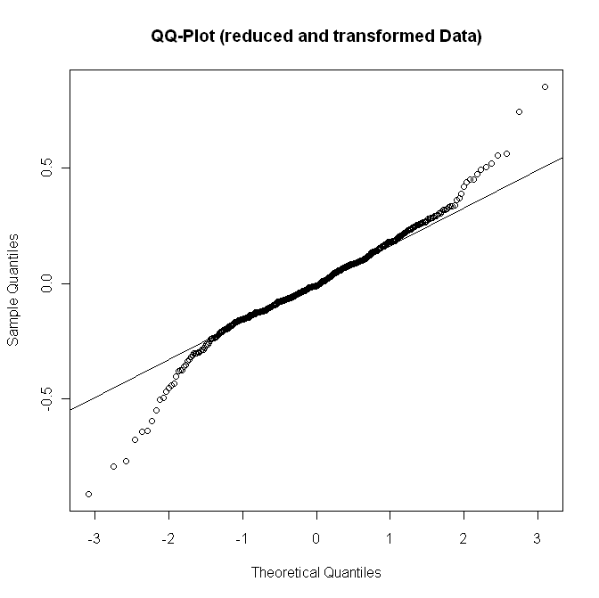
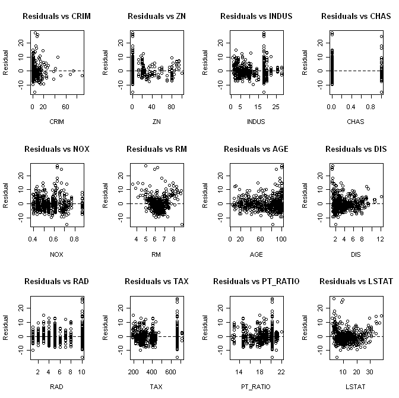
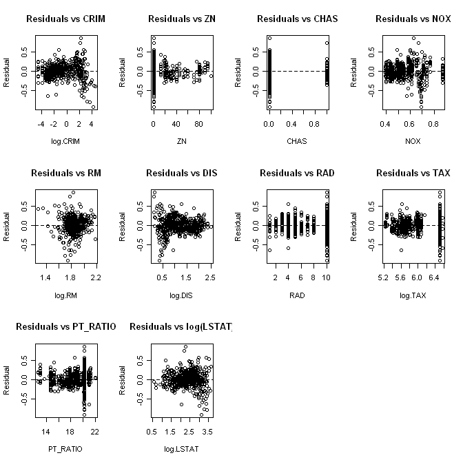
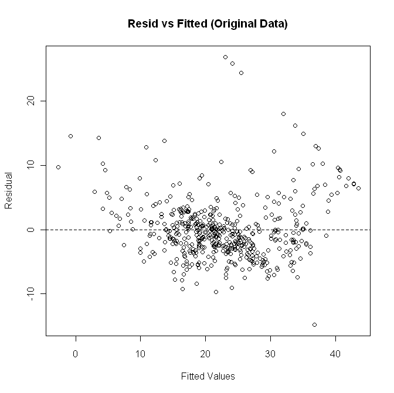
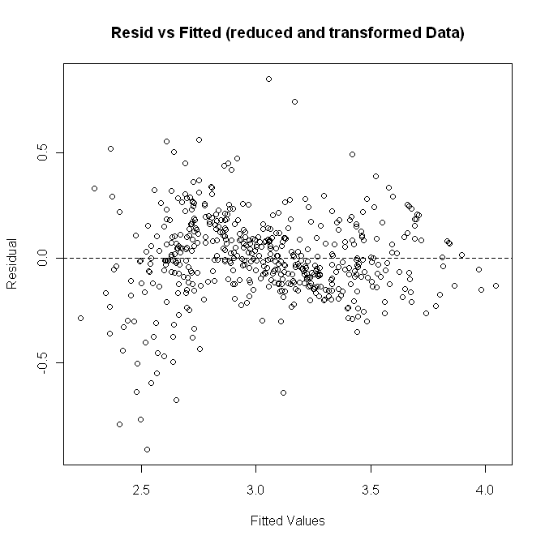

### Summary
&nbsp;&nbsp;&nbsp;&nbsp;&nbsp;&nbsp;In this paper the median value of owner-occupied homes in Boston MA is regressed on several covariates. Out of twelve possible predictor variables, the most parsimonious linear regression model contained ten predictor variables. Those predictors include: per capita crime rates by town (`CRIM`), proportion of residential land zoned for lots over 25,000 sq. ft (`ZN`), Charles River dummy variable (`CHAS`), nitric oxides concentration (parts per 10 million) (`NOX`), average number of rooms per dwelling (`RM`), weighted distances to five Boston employment centers (`DIS`), index of accessibility to radial highways (`RAD`), full-value property-tax rate per USD 10,000 (`TAX`), pupil-teacher ratio by town (`PTRATIO`), and percentage of lower status of the population (`LSTAT`). The two predictors left out of the model were: proportion of non-retail business acres per town (`INDUS`) and proportion of owner-occupied units built prior to 1940 (`AGE`). All regression coefficients were statistically significant at the alpha = .05 level.
### Introduction
&nbsp;&nbsp;&nbsp;&nbsp;&nbsp;&nbsp;An important part in land management is predicting home values for specific areas. The knowledge of home prices for areas would give useful information for marketing and retail deployment. There are several variables to consider in building a model to obtain good predictions. Here we will consider several predictors in an attempt to find the most parsimonious model that best explains median value of owner-occupied homes to in Boston MA. Our covariates for prediction include: per capita crime rates by town (`CRIM`), proportion of residential land zoned for lots over 25,000 sq. ft (`ZN`), proportion of non-retail business acres per town (`INDUS`), Charles River dummy variable (`CHAS`), nitric oxides concentration (parts per 10 million) (`NOX`), average number of rooms per dwelling (`RM`), proportion of owner-occupied units built prior to 1940 (`AGE`), weighted distances to five Boston employment centers (`DIS`), index of accessibility to radial highways (`RAD`), full-value property-tax rate per USD 10,000 (`TAX`), pupil-teacher ratio by town (`PTRATIO`), and percentage of lower status of the population (`LSTAT`). In the following sections we will use regression methods with the standard assumptions to find the best fitting models, drawing final conclusions using several diagnostic procedures.
###Methods
&nbsp;&nbsp;&nbsp;&nbsp;&nbsp;&nbsp;To analyze the data of median value of owner-occupied homes (USD 1000’s) and several covariates, R software was utilized in generating least squares regression models.
### Analysis
&nbsp;&nbsp;&nbsp;&nbsp;&nbsp;&nbsp;We begin by fitting the full model:

&nbsp;&nbsp;&nbsp;&nbsp;&nbsp;&nbsp;The scatterplots and correlations of the response versus the predictors suggest a strong positive linear relationship between the response, median home value (`MEDV`), and average number of rooms per dwelling (`RM`) with a correlation of 0.6954. There also appears to be a strong negative relationship between `MEDV` and the percentage of lower status of the population (`LSTAT`) with a correlation of -0.7377. Looking amongst the predictors themselves for correlation we can see that several predictors are highly correlated with one another. Most notably the full-value property tax (`TAX`) and the index of accessibility to radial highways (`RAD`) have the highest correlation of 0.8274. The plot of the residuals versus the fitted values looks unusual. Although there is not an obvious pattern, a faint u-shape is visible. The plots of the residuals versus the predictors also suffers irregularities. The `CRIM`, `RM`, and `LSTAT` exhibit curvilinear patterns, suggesting a non-linear relationship. Other predictors such as DIS and AGE have cone shaped patterns placing the constant error variance assumption in doubt. A normal probability plot and histogram of the residuals also do not look good. There does appear to be right skewness in the data, suggesting the normal error variance assumption is violated. Although remedial measures will need to be implemented, reduction of the number of explanatory variables is first performed via “best” subsets and stepwise regression. The estimated parameters for the full model and their respective p-values can be seen in [**_Table 1_**](#Table-1).

&nbsp;&nbsp;&nbsp;&nbsp;&nbsp;&nbsp;When performing “best” subsets for variable reduction, the results of using Mallows’  criteria were the same as that using the adjusted  criteria. Also performing forward and backward stepwise regression we select the same model as the “best” subsets. The model included 10 predictor variables. That is, all predictors with the exception of `INDUST` and `AGE`. The  value for this model of 9.00089 < p = 11 indicates there is little or no bias in the model. Also note that the model picked using  in “best” subsets is the full model. The exact same problems we had for the full model carry over into this reduced model. A formal BP test is performed to confirm the violation of constant error variance, the results provide a p-value < 2.2e-16 which strongly suggest the variance is not constant. A correlation test for normality is also performed to formally test if the data errors are normally distributed. The p-value < 2.2e-16 also strongly suggests the data is not normally distributed. Several transformations were then performed based on the appearance of residual plots, and the log transformation was applied to the predictors `CRIM`, `RM`, `DIS`, `TAX`, and `LSTAT`, as well as the response variable `MEDV`. These transformations help the data appear more normal and the residual plots for the predictors appear slightly more random. However, the problem of non-normality and non-constant error variance still persists. The BP test for constancy of error variance is still significant with a p-value < 2.2e-16 and the correlation test for normality remains significant has improved slightly, with a p-value < 1.451e-09. The model with applied transformations can be seen in [**_Table 2_**](#Table-2). The search for influential observations is taken on next.

&nbsp;&nbsp;&nbsp;&nbsp;&nbsp;&nbsp;Looking at the leverages, values exceeding $2p/n=22/506=0.0435$ would be considered outlying x values. For our data there are 37 observations possessing leverage values higher than 0.0435, and possibly influencing our regression parameters. To further investigate the high leverages the DFBETAS were computed for the data, and found that 31 observations held DFBETAS larger than $2/\sqrt{n}=2/\sqrt{506}=0.8891$ , so several observations are deemed influential in terms of the regression coefficients. On the brighter side all variance inflation factors are under 10, suggesting multicolinearity is not a major problem.
### Conclusion
&nbsp;&nbsp;&nbsp;&nbsp;&nbsp;&nbsp;The purpose of our study was to determine which covariates best influence median value of owner-occupied homes in Boston MA. We started with the twelve covariates listed above, and narrowed them down to a final reduced model after performing “best” subsets, stepwise regression and evaluating several different diagnostics, thereby creating a combination of covariates that is concise, yet complete. The final reduced model chosen is written out below.

Where,

&nbsp;&nbsp;&nbsp;&nbsp;&nbsp;&nbsp;A possible future study could involve a spatially weighted regression (GWR) model. Since the Charles River dummy variable is determined by the observations Census tract boundary it’s safe to assume that all observations are measures at the Census tract level. A GWR model could provide better estimates since, especially for housing data, contiguous tracts may be more related than distant tracts. Robust regression might also be helpful to deal with the large number of influential cases present in the data.
### Appendix

##### Table 1
<table>
<tr>
<th></th><th>Estimate</th><th>Std. Error</th><th>t value</th><th>Pr(>|t|)</th>
</tr>
<tr>
<th>(Intercept)</th><td>3.68E+01</td><td>4.76E+00</td><td>7.73</td><td>6.09E-14 ***</td>
</tr>
<tr>
<th>CRIM</th><td>-1.00E-01</td><td>3.23E-02</td><td>-3.109</td><td>0.001986	**</td>
</tr>
<tr>
<th>ZN</th><td>5.20E-02</td><td>1.42E-02</td><td>3.655</td><td>0.000284	***</td>
</tr>
<tr>
<th>INDUS</th><td>-8.01E-04</td><td>6.23E-02</td><td>-0.013</td><td>0.989743</td>
</tr>
<tr>
<th>CHAS</th><td>2.88E+00</td><td>8.75E-01</td><td>3.295</td><td>0.001056	**</td>
</tr>
<tr>
<th>NOX</th><td>-1.77E+01</td><td>3.87E+00</td><td>-4.579</td><td>5.93E-06	***</td>
</tr>
<tr>
<th>RM</th><td>3.74E+00</td><td>4.21E-01</td><td>8.879</td><td><2.00E-16	***</td>
</tr>
<tr>
<th>AGE</th><td>3.62E-04</td><td>1.34E-02</td><td>0.027</td><td>0.978404</td>
</tr>
<tr>
<th>DIS</th><td>-1.53E+00</td><td>2.03E-01</td><td>-7.552</td><td>2.10E-13	***</td>
</tr>
<tr>
<th>RAD</th><td>5.55E-01</td><td>1.49E-01</td><td>3.737</td><td>0.000208	***</td>
</tr>
<tr>
<th>TAX</th><td>-7.83E-03</td><td>3.19E-03</td><td>-2.456</td><td>0.014398	*</td>
</tr>
<tr>
<th>PT_RATIO</th><td>-8.50E-01</td><td>1.31E-01</td><td>-6.483</td><td>2.18E-10	***</td>
</tr>
<tr>
<th>LSTAT</th><td>-5.47E-01</td><td>5.09E-02</td><td>-10.75</td><td><2.00E-16	***</td>
</tr>
<tr>
<td colspan='5'>Significance codes:  0 ‘***’ 0.001 ‘**’ 0.01 ‘*’ 0.05 ‘.’ 0.1 ‘ ’ 1</td>
</tr>
</table>

##### Table 2
<table>
<tr>
<th></th><th>Estimate</th><th>Std. Error</th><th>t value</th><th>Pr(>|t|)</th>
</tr>
<tr>
<th>(Intercept)</th><td>5.3803476</td><td>0.3775079</td><td>14.252</td><td>< 2.00E-16 ***</td>
</tr>
<tr>
<th>log(CRIM)</th><td>-0.0321466</td><td>0.0109476</td><td>-2.936</td><td>0.003475 **</td>
</tr>
<tr>
<th>ZN</th><td>-0.0011341</td><td>0.0005444</td><td>-2.083</td><td>0.037746 *</td>
</tr>
<tr>
<th>CHAS</th><td>0.1155283</td><td>0.0365905</td><td>3.157</td><td>0.001689 **</td>
</tr>
<tr>
<th>NOX</th><td>-0.5675092</td><td>0.1692577</td><td>-3.353</td><td>0.000861 ***</td>
</tr>
<tr>
<th>log(RM)</th><td>0.3621877</td><td>0.1083668</td><td>3.342</td><td>0.000894 ***</td>
</tr>
<tr>
<th>log(DIS)</th><td>-0.1672401</td><td>0.0333142</td><td>-5.02</td><td>7.22E-07 ***</td>
</tr>
<tr>
<th>RAD</th><td>0.0234055</td><td>0.006509</td><td>3.596</td><td>0.000356 ***</td>
</tr>
<tr>
<th>log(TAX)</th><td>-0.1785038</td><td>0.0471076</td><td>-3.789</td><td>0.00017 ***</td>
</tr>
<tr>
<th>PT_RATIO</th><td>-0.0331228</td><td>0.0053639</td><td>-6.175</td><td>1.38E-09 ***</td>
</tr>
<tr>
<th>log(LSTAT)</th><td>-0.4150018</td><td>0.0245844</td><td>-16.881</td><td>< 2.00E-16 ***</td>
</tr>
<tr>
<td colspan=5>Significance codes:  0 ‘***’ 0.001 ‘**’ 0.01 ‘*’ 0.05 ‘.’ 0.1 ‘ ’ 1</td>
</tr>
</table>

##### Plot 3
#### Scatterplot of Original Data

##### Plot 4

##### Plot 5

##### Plot 6

##### Plot 7

##### Plot 8
#### Residual vs. Predictor Plots for Original Data

##### Plot 9
#### Residual vs. Predictor Plots for Reduced and Transformed Data

##### Plot 10

##### Plot 11

